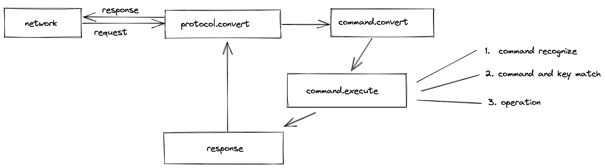

# Godis

> Go  语言实现 `redis` 协议的功能

## TODO

- [ ] tcp 协议
- [ ] 五种数据结构
- [ ] 大部分常用的命令
- [ ] 可通过 redis-cli 连接且可用

## Not In Feature

- persistence data to local
- distribution (may be will support, not sure right now)

## Design

