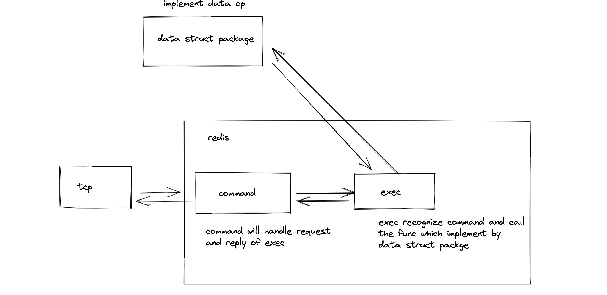

# redis

Implement how to execute redis command.

## TODO

拆开 command 的实现和数据底层操作的逻辑,最后根据根命令找到对应的方法,然后传入 Command struct,但是这样做很有可能会出现 cycle import 问题,
这个可以通过定义 interface 的方式解决不直接调用实现即可,但是如何通过 command 确定要调的方法呢?

## 暂时想法

1. 由 `exec` 方法作为入口,内部实现对 `datastruct` 包内的方法的封装,
2. `datastruct` 包保持独立,不引入 redis 或者 protocol 包

